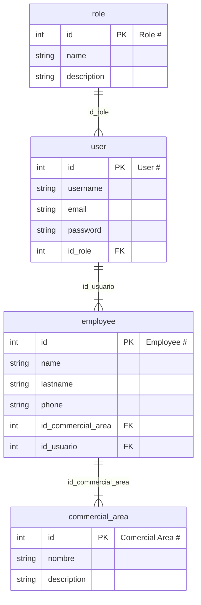

## MySQL.
`docker-compose up`

## Install dependencies.
`gradle build --refresh-dependencies`

## Entity Relationship

## Insert data 
`resources/META-INF/sql/create.sql`

## Run project locally
`gradle tomcatRunWar`

## Use
Go to http://localhost:8080/ClienteUMB

## Autor
- [Nelson Castellanos](https://www.linkedin.com/in/nelson-javier-castellanos-garz%C3%B3n-b66861173/)
